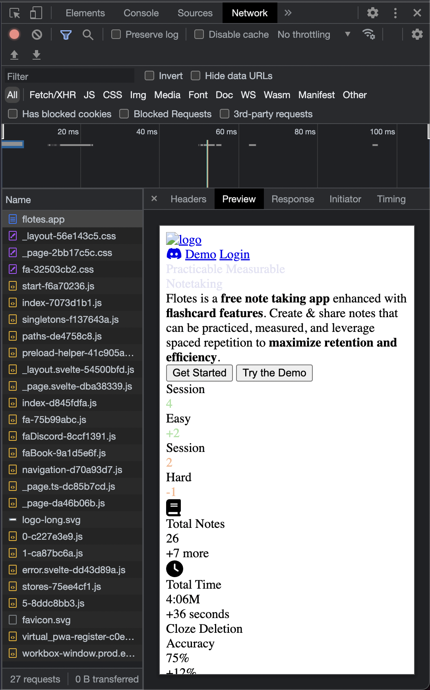
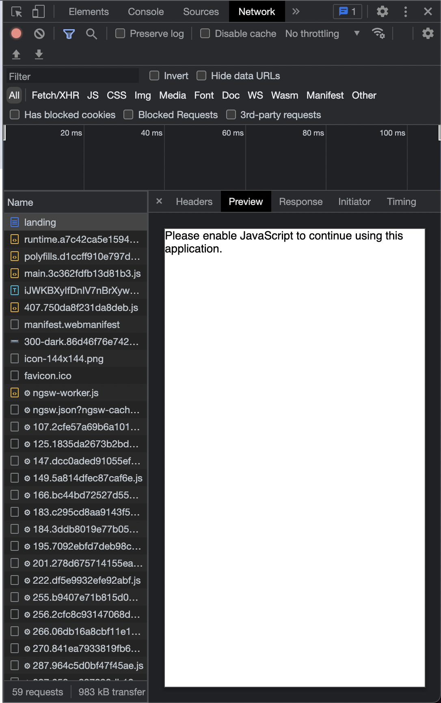
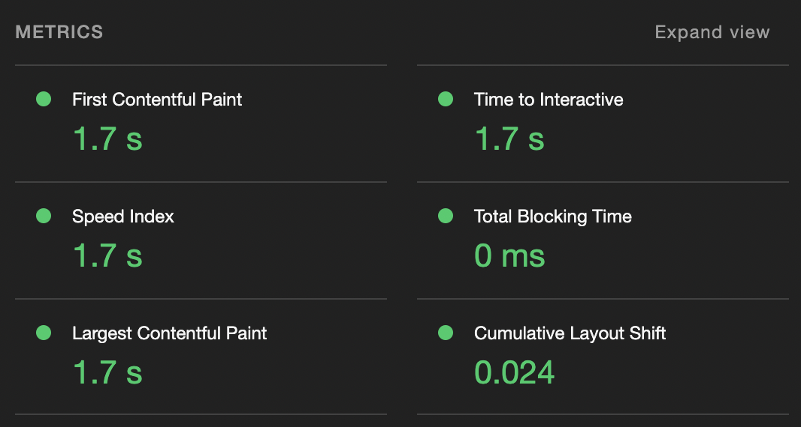
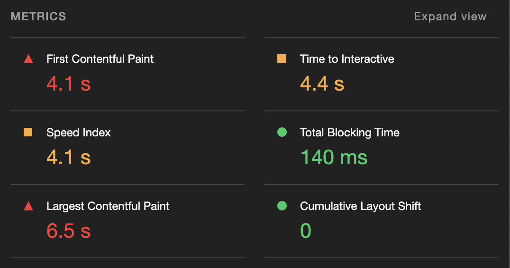

# How I Made Flotes 2.4x Faster Switching to Svelte

Server side rendering, lazy loading, pre-render, and less javascript


## Origin

In June of 2022, I finally became curious (and frustrated) enough to give something new a try.

That something was Svelte(Kit). I had been working on Enterprise applications in Angular for years
and so I always wrote my side projects in Angular as well.

One weekend, I was hell-bent on improving my lighthouse score and speeding up the apps initial page load.

I spent hours refactoring, lazy loading, removing dependencies. After everything I tried my scores were still far from ideal in production.

This article is not to say that Angular *can't* be fast. That's not true. It's that SvelteKit makes it 
intuitive and simple to be fast.

## The Technical 

### Server Side Rendering
Svelte with SvelteKit promotes Server Side Rendering out of the box and built in. They provide tools and conventions to intuitively determine when you're in the context of server side rendering vs client side rendering.

For example, everything on this page that is not dynamic, is server side rendered. We effectively get a shell of our component, and then populate the dynamic content on the client.

TODO: Change this part to be simpler.
```javascript
<script>
	import { onMount } from 'svelte';

	let photos = [];

	onMount(async () => {
		const res = await fetch(`/tutorial/api/album`);
		photos = await res.json();
	});
</script>
```

Why Server Side Rendering: A simple explanation is that going from `Server --> Client` is faster than `Server --> Client --> Server --> Client`

Another way of looking at this is that traditional SPA frameworks like Angular must pull down and parse/execute some javascript before displaying anything on the screen. Thus a site shipping raw html/css straight from the server, while not interactive, can have better perceived performance and time to paint.

**How do I know something is Server Side Rendered?**: One way I do this is by looking at the network tab. Your first request is likely a document, you can click the document and then click the preview tab and you should see the mostly unstyled content.



Compare this to an app without SSR and the difference is clear.



### Lazy Loading

Just about every framework comes with some implementation of lazy loading / code splitting.

Svelte leverages Vite which makes lazy loading intuitive & practically automatic.

For example, a component or page's dependencies won't be loaded until that component/page is created. So just by only importing what we need, we're effectively lazy loading everything else.

```javascript
  <script>
    // OKAY
    import Fa from 'svelte-fa';
    import { faUserGroup } from '@fortawesome/free-solid-svg-icons/faUserGroup';
    import { faClock } from '@fortawesome/free-solid-svg-icons/faClock';
    // AVOID
    import { DatabaseClient } from '@supabase'
  </script>
  
  <div>
    Really simple landing page
    <Fa icon={faUserGroup}/>
    <Fa icon={faClock}/>
  </div>
```

### Prerender

Svelte can `prerender` a page. Any content that is not dynamic (the same to all users), can be prerendered. Prerendering computes the contents of a page at build time and saving the HTML for display. i.e. we don't recompute the page for each visitor and instead do the computation during build time.

It's as easy as setting a variable in our `+page.ts`
```javascript
export const prerender = true;
```

Again, other frameworks can achieve this, it's more so how easy and intuitive svelte(kit) makes it.

### Less Javascript

Svelte just ships less javascript. And (imo) makes it easier to write apps with less code / boilerplate. 

Comparing the size of the packages. -- *See caveat
- [Svelte Package Size](https://bundlephobia.com/package/svelte@3.55.0)
- [Angular Package Size](https://bundlephobia.com/package/@angular/core@15.0.4)

> Not a totally fair comparison, Angular brings a lot, and by contrast this doesn't include kit. However, Angular brings on a lot of overhead, and claims that svelte has to pull in a bunch of separate libraries is not necessarily true. This is because it uses native web apis where possible. -- For example, my production app doesn't take on any additional dependencies that it otherwise wouldn't using Angular. i.e. I would need to download `CodeMirror` regardless of which framework I chose.

Svelte Kit makes it intuitive to write code on the server as well. The experience of moving code out to the server, even as a frontend developer, is relatively easy. 

TODO: Server side code example (Maybe server hooks or something)

Summary
- Smaller package
- Less boilerplate
- Move logic to server as frontend developer




