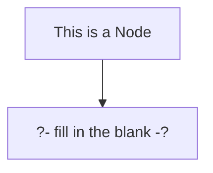

## Changes

Overview:
- Notebooks (not just notes) can be archived. This helps keep "My Notebooks" **focused and organized**.
  - Shared Notebooks can be archived, this will only impact the user that archives. It will not impact other users of the notebook or the author.
  - i.e. archive and Spaced Repetition are specific to the user. The notebook is shared.
- Notebooks now display completion status: On the stats screen, in the sidenav, on the archive screen.
  - Completed notebooks sink to the bottom of "My Notebooks" and surface to the top of Archived
- Spaced Repetition Indicators now pulse. My Notebooks is organized by spacing. The closer to overdue, the higher it surfaces to the top of the list.
- Invites have been redesigned and will show a pulsing indicator when new invites are available.
- A new navigation widget has been added to the top right corner of the screen:
  - Navigate to: Edit, Practice, Stats.
  - When practicing, will display the current position of practice
  - The navigation options still exist in the `...` and have been updated to be contextual
    - e.g. Only options that make sense will be displayed. Or if practicing will say "Return to Practice", things like that.
- When practicing, the footer has been fixed so that it *always* displays on mobile. Before, you had to install as PWA, or the url-bar would hide the show answer. This was really really *really* confusing.
- Fill in the blanks have been fixed on Safari/iPhone. Text was invisible. Additionally, outlines would go out of the bounds of their container. Now the outlines light up instead.
- Improvements to this blog (yay). Posts are now organized by type, there's a new header, as well as an about me.
- Links now open in a new tab instead of the current tab
- Batch Fixes:
  - A mermaid version failed in production on refresh, but not in dev. This is fixed by reverting to a previous version.
  - Author always displayed the current users name. 
  - Searching left the `enter` key bound even when the modal was closed
    - Minor, redundantly binding and unbinding keys has been fixed. Not a noticable performance improvement but definitely unwanted.
  - Padding applied to the bottom of the editor so if your text touches the bottom you can scroll down further
  - Inline preview let text overflow instead of wrapping.

### Support for Mermaid
- Support for mermaid `graph` and `sequenceDiagram`. 
- Fill in the Blanks work inside of mermaid.

Example Syntax

- `?- PHRASE -?` is a custom Flotes syntax that can be used in your mermaid charts to challenge yourself on its content.

